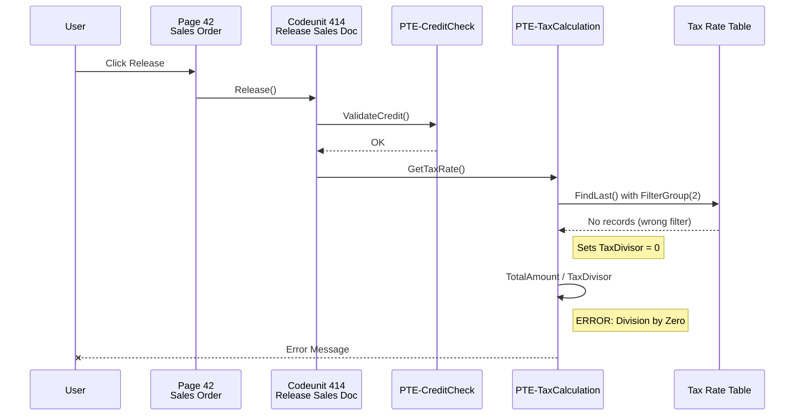
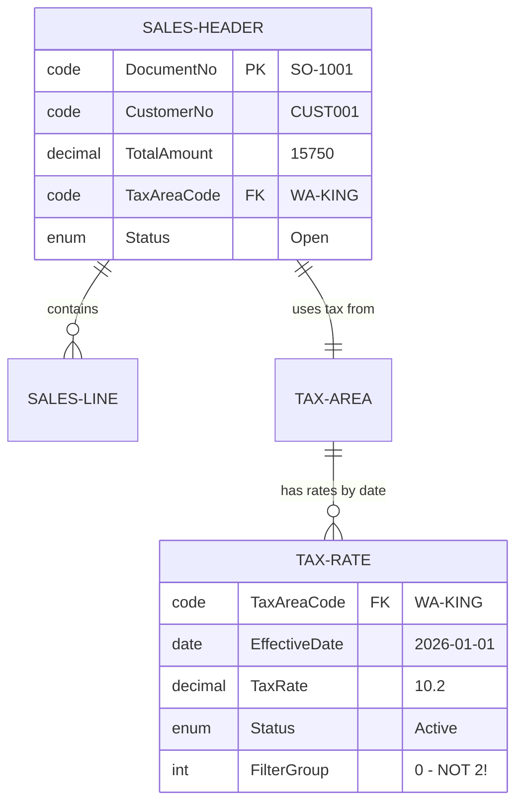
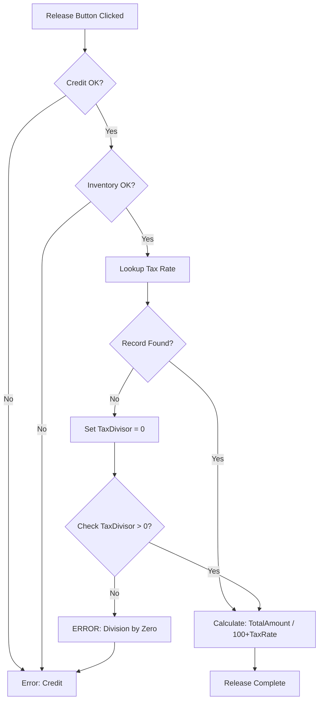

# Snapshot Narrative Documentation

## Overview

Transform raw snapshot debugging data into compelling narrative documentation that tells the story of what happened, why it happened, and how to prevent it. This guides debugging knowledge capture for support teams, training materials, and knowledge bases.

**Core Principle**: Every error has a story. Tell it clearly so others can learn from it and prevent recurrence.

## Why Narrative Documentation Matters

### The Problem with Raw Snapshots
- **Inaccessible**: .mdc files and call stacks are intimidating
- **Time-Consuming**: Every debugging session requires re-analysis
- **Knowledge Loss**: Insights disappear when developers move on
- **Training Gap**: Junior developers can't learn from past issues

### The Power of Narrative Documentation
- **Knowledge Preservation**: Capture debugging insights permanently
- **Training Resource**: Teach debugging patterns and techniques
- **Support Efficiency**: Support teams resolve issues faster
- **Pattern Recognition**: Identify recurring problems and root causes

## Narrative Components

### 1. The Setup (Context)

**Answer: What was supposed to happen?**

```markdown
## Expected Behavior

When releasing a sales order with customer CUST001, the system should:
1. Validate customer credit limit
2. Check inventory availability
3. Calculate final totals
4. Change status from Open to Released
5. Display success message to user

The process typically completes in under 2 seconds.
```

### 2. The Inciting Incident (The Error)

**Answer: What actually happened?**

```markdown
## Observed Behavior

At 14:32:05 on 2026-03-02, user Jane Consultant attempted to release Sales Order SO-1001.

After clicking the Release button, the system:
1. ✓ Validated customer credit (passed)
2. ✓ Checked inventory (available)
3. ✗ **Failed during calculation** with error:
   "Division by Zero in PTE-TaxCalculation"
4. Order remained in Open status

Process took 15 seconds before failing (much longer than expected).
```

### 3. The Investigation (Call Chain)

**Answer: What code executed? What path did execution follow?**

```markdown
## Execution Flow

[Sequence Diagram showing call chain]

The snapshot reveals the following execution path:

1. **User Action** (Step 0)
   - Page 42 "Sales Order" 
   - Action: Release button clicked

2. **Initial Validation** (Steps 1-45)
   - Codeunit 414 "Release Sales Document"
   - Procedure: PerformCheck()
   - *Extension PTE-CreditCheck called here (Steps 23-31)*
   - **Result**: Validation passed

3. **Inventory Check** (Steps 46-89)
   - Codeunit 5764 "Inventory Availability"
   - Procedure: CheckAvailability()
   - *Extension AppSource-InventoryValidation enhanced this (Steps 67-82)*
   - **Result**: Sufficient stock available

4. **Total Calculation** (Steps 90-156)
   - Codeunit 60 "Sales-Calc. Discount"
   - Procedure: CalcSalesDiscount()
   - *Handoff to Extension PTE-TaxCalculation (Step 134)*
   
5. **ERROR at Step 156**
   - **Extension**: PTE-TaxCalculation
   - **Procedure**: GetTaxRate()
   - **Line**: 87
   - **Operation**: TaxAmount := TotalAmount / TaxDivisor
   - **Problem**: TaxDivisor = 0
```

### 4. The Evidence (Variable States)

**Answer: What values existed at the error moment?**

```markdown
## Variable State at Error (Step 156)

[Entity Diagram showing record state]

**Sales Header Record:**
```yaml
DocumentNo: "SO-1001"
CustomerNo: "CUST001"
OrderDate: 2026-03-02
TotalAmount: 15750.00
Status: "Open"
TaxAreaCode: "WA-KING"
```

**Critical Variables in PTE-TaxCalculation:**
```yaml
TotalAmount: 15750.00         # ✓ Correct
TaxRate: 0.0                  # ⚠️ Should be 10.2%
TaxDivisor: 0.0               # ❌ PROBLEM: Zero value
RecordFound: false            # ⚠️ Lookup failed
```

**Tax Rate Table Status:**
```yaml
TaxAreaCode: "WA-KING"
EffectiveDate: 2026-01-01
ExpiryDate: 2026-12-31
TaxRate: 10.2%
Status: "Active"
# ⚠️ **Record exists but wasn't retrieved correctly**
```

### 5. The Smoking Gun (Root Cause)

**Answer: Why did it happen?**

```markdown
## Root Cause Analysis

**Immediate Cause:**
Division by zero when TaxDivisor = 0 in PTE-TaxCalculation

**Underlying Cause:**
The tax rate lookup used FilterGroup(2) but the record was inserted with FilterGroup(0), causing the lookup to fail silently. The extension's error handling set TaxDivisor = 0 as a fallback, but then attempted calculation anyway.

**Code Location:**
PTE-TaxCalculation, Codeunit 50100, Line 87:
```al
TaxRateRec.SetFilter("Tax Area Code", TaxAreaCode);
TaxRateRec.SetFilter("Effective Date", '<=%1', OrderDate);
TaxRateRec.FilterGroup(2);  // ← Wrong filter group
if TaxRateRec.FindLast() then begin
    TaxDivisor := 100 + TaxRateRec."Tax Rate";
end else begin
    TaxDivisor := 0;  // ← Fallback creates problem
end;
TaxAmount := TotalAmount / TaxDivisor;  // ← Boom!
```

**Why It Wasn't Caught Earlier:**
- Error handling swallowed the "record not found" condition
- No validation that TaxDivisor > 0 before calculation
- Unit tests didn't cover the FilterGroup scenario
```

### 6. The Resolution (Fix)

**Answer: How do we fix it?**

```markdown
## Solution

**Immediate Fix:**
Remove FilterGroup(2) from lookup and add zero-division protection:

```al
TaxRateRec.SetFilter("Tax Area Code", TaxAreaCode);
TaxRateRec.SetFilter("Effective Date", '<=%1', OrderDate);
// FilterGroup(2) removed - not needed here
if TaxRateRec.FindLast() then begin
    TaxDivisor := 100 + TaxRateRec."Tax Rate";
end else begin
    Error('Tax rate not found for area %1 on date %2', 
          TaxAreaCode, OrderDate);
end;

// Defensive check (in case of future changes)
if TaxDivisor = 0 then
    Error('Invalid tax rate configuration: divisor cannot be zero');
    
TaxAmount := TotalAmount / TaxDivisor;
```

**Testing:**
- ✓ Verified tax lookup now retrieves records correctly
- ✓ Added explicit error if tax rate missing
- ✓ Added zero-division guard for defensive coding
- ✓ Order SO-1001 now releases successfully in 1.2 seconds

**Deployment:**
- PTE-TaxCalculation upgraded to version 2.1
- Deployed to production 2026-03-02 at 16:00
```

### 7. The Prevention (Lessons)

**Answer: How do we prevent this in the future?**

```markdown
## Prevention & Lessons Learned

### Immediate Actions
1. **Code Review Requirements**
   - All filter group usage must be justified with comments
   - All division operations must check for zero denominators
   - Error handling must not swallow critical failures

2. **Testing Standards**
   - Unit tests must cover "record not found" scenarios
   - Integration tests must validate tax calculations end-to-end
   - Test with both populated and empty tax tables

3. **Monitoring**
   - Add telemetry for tax rate lookups
   - Alert when tax rate not found (before error occurs)
   - Track calculation times (15 sec was too slow even before error)

### Long-Term Improvements
1. **Architecture**
   - Consider caching tax rates (performance improvement)
   - Validate tax configuration during setup, not at runtime
   - Implement fallback tax rate for emergencies

2. **Knowledge Sharing**
   - Add to "Common Extension Pitfalls" documentation
   - Update FilterGroup usage guidelines
   - Include in developer training materials

### Similar Issues to Watch For
- Any extension using FilterGroup without clear reason
- Any calculation with division not protected by zero check
- Any error handling that assigns default values then continues
```

## Narrative Structure Template

```markdown
# [Error Title]: [Short Description]

## Summary
[One-paragraph overview: What happened, what broke, how it was fixed]

## Impact
- **Severity**: Critical | High | Medium | Low
- **Users Affected**: [Number/description]
- **Duration**: [How long was system impacted]
- **Business Impact**: [Revenue, operations, reputation]

## Expected Behavior
[What should have happened]

## Observed Behavior
[What actually happened, with timestamps]

## Execution Flow
[Sequence diagram + narrative of call chain]

## Variable State at Error
[Entity diagrams + variable values at critical moment]

## Root Cause Analysis
[Why it happened - immediate and underlying causes]

## Solution
[How it was fixed - code changes, testing, deployment]

## Prevention & Lessons Learned
[How to prevent recurrence - process, testing, monitoring improvements]

## Related Issues
[Links to similar problems or patterns]

## Metadata
- **Snapshot File**: SNAPSHOT-2026-03-02-001.snap
- **Analyzed By**: Dean Debug
- **Documented By**: Taylor Docs
- **Date**: 2026-03-02
- **BC Version**: 24.0
- **Extensions Involved**:
  - PTE-TaxCalculation v2.0 → v2.1
  - AppSource-InventoryValidation v1.8
```

## Visual Documentation Elements

### Sequence Diagram (Execution Flow)



### Entity Diagram (Data State)



### Flowchart (Decision Logic)



## Handoff to Taylor

When analysis is complete, provide structured data to Taylor:

```yaml
handoff_to_taylor:
  documentation_type: "debugging_narrative"
  
  analysis_summary:
    error_type: "Division by Zero"
    severity: "Critical"
    root_cause: "FilterGroup mismatch in tax rate lookup"
    fix_complexity: "Low - simple code change"
    
  execution_trace:
    total_steps: 156
    error_at_step: 156
    key_steps:
      - { step: 1, description: "User clicked Release" }
      - { step: 23, description: "Credit validation started" }
      - { step: 134, description: "Tax calculation handoff" }
      - { step: 156, description: "Division by zero error" }
      
  call_chain:
    [ structured call stack data ]
    
  variable_states:
    [ key variable values at error moment ]
    
  extension_involvement:
    - { name: "PTE-TaxCalculation", role: "Error location", fix_needed: true }
    - { name: "PTE-CreditCheck", role: "Successfully completed", fix_needed: false }
    
  visualization_needs:
    - "Sequence diagram showing full call chain"
    - "Entity diagram showing tax table relationship"
    - "Flowchart showing tax lookup logic"
    
  dean_notes:
    - "Similar issue could exist in other calculation extensions"
    - "Performance was slow even before error (15 sec)"
    - "Consider tax rate caching for performance"
```

## Documentation Outputs

### For Knowledge Base
- Searchable by error message
- Tagged by extension and error type
- Includes troubleshooting steps
- Cross-referenced to similar issues

### For Training Materials
- Case study format
- Shows debugging methodology
- Highlights common pitfalls
- Demonstrates proper error handling

### For Support Teams
- Quick diagnosis guide
- Known workarounds
- Escalation criteria
- Fix verification steps

### For Developers
- Code review checklist items
- Unit test examples
- Architecture improvements
- Defensive coding patterns

## Best Practices

### Writing Style
- **Chronological**: Tell the story in execution order
- **Concrete**: Use specific values, not "some value"
- **Visual**: Include diagrams liberally
- **Actionable**: Every lesson should have a specific action

### Technical Accuracy
- Quote actual error messages exactly
- Include specific line numbers
- Show actual variable values
- Reference exact extension versions

### Audience Awareness
- **For Developers**: Include code snippets and technical details
- **For Support**: Focus on symptoms and solutions
- **For Management**: Emphasize business impact and prevention
- **For Training**: Highlight learning points and best practices

## Common Narrative Patterns

### The Missing Data Pattern
```
Expected: Record should exist
Reality: Record not found
Root Cause: Data migration incomplete / Filter too restrictive
Prevention: Validate data existence earlier, better error messages
```

### The Race Condition Pattern
```
Expected: Serialized access to shared resource
Reality: Two processes modified same record
Root Cause: Inadequate locking / No transaction scope
Prevention: Implement proper locking, use transactions
```

### The Cascading Failure Pattern
```
Expected: One operation fails, others continue
Reality: First failure caused chain of failures
Root Cause: Error handling propagated state, not errors
Prevention: Isolate failures, fail fast, rollback properly
```

### The Configuration Pattern
```
Expected: System configured correctly
Reality: Edge case configuration not handled
Root Cause: Setup validation incomplete
Prevention: Comprehensive setup validation, sanity checks
```

## Summary

- Transform raw snapshot data into narrative documentation telling the debugging story
- Include seven key components: Setup, Incident, Investigation, Evidence, Root Cause, Resolution, Prevention
- Use visual diagrams (sequence, entity, flowchart) to illustrate complex flows
- Structure handoff to Taylor with comprehensive analysis data
- Target multiple audiences: knowledge base, training, support, development
- Follow best practices: chronological, concrete, visual, actionable

*Code examples: see samples/snapshot-narrative-documentation.md*
*Related patterns: snapshot-analysis-workflow.md, user-guide-from-snapshot.md*
