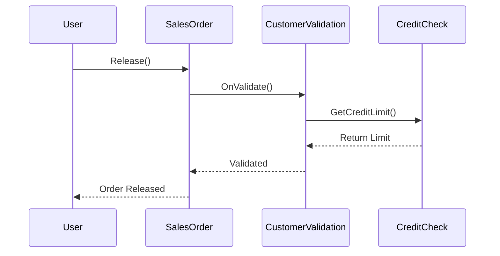
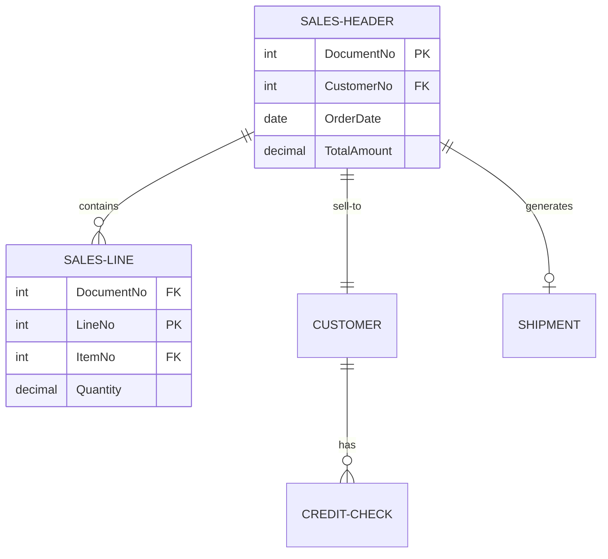
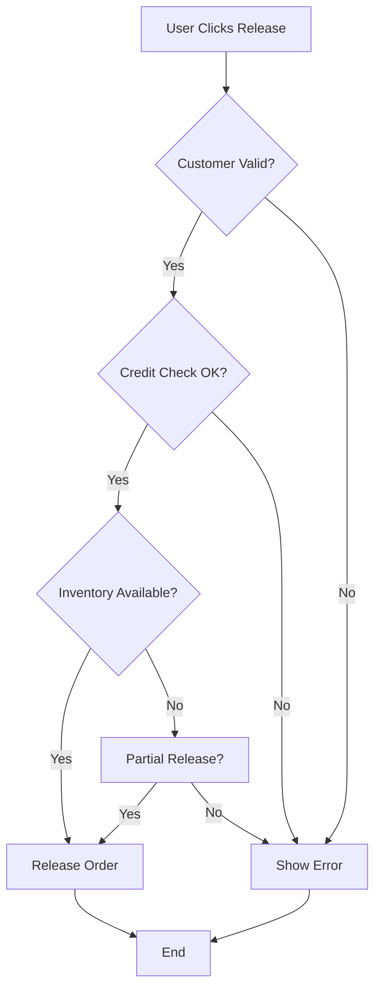
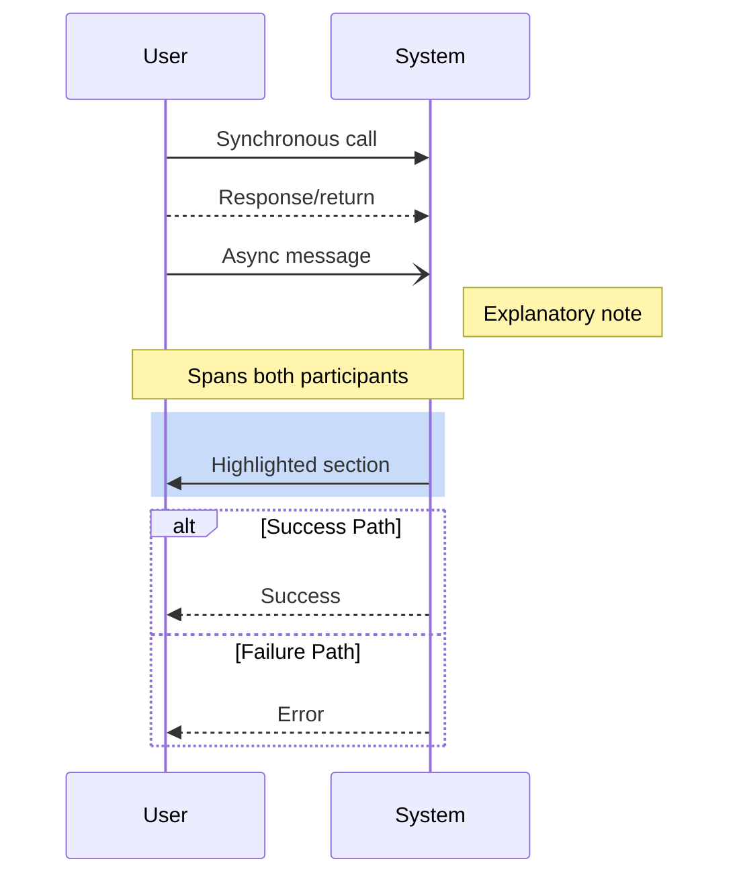
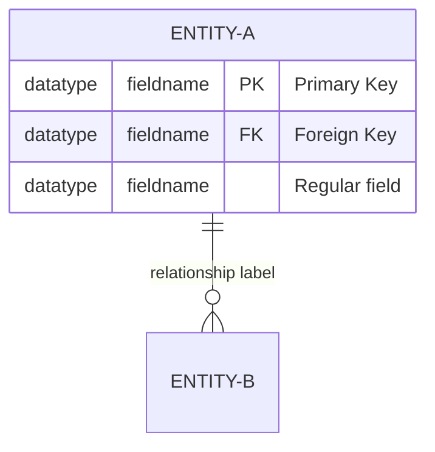
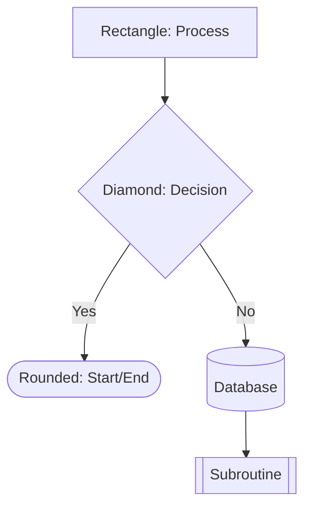

# Mermaid Diagram Documentation

## Overview

Mermaid is a markdown-compatible diagramming syntax that enables creation of professional diagrams directly in documentation. It's ideal for BC documentation because diagrams render in GitHub, VS Code, and most documentation platforms without external tools.

**Core Principle**: Complex execution flows, data relationships, and decision logic are often clearer when visualized than when described in prose.

## When to Use Visual Documentation

Visual diagrams should complement (not replace) written documentation when:
- **Execution flows** involve multiple objects or extensions
- **Data relationships** span multiple tables with complex foreign keys
- **Decision logic** has multiple branches and conditions
- **User workflows** involve multiple pages and navigation steps
- **Integration patterns** cross system boundaries

## Diagram Types

### Sequence Diagrams - Execution Flow

Use sequence diagrams to show **who calls what, in what order**:



**Best for:**
- Debugging documentation showing call chains
- API interaction documentation
- Event sequence explanations
- Integration workflows

### Entity Relationship Diagrams - Data State

Use ERD to show **what data exists and how it relates**:



**Best for:**
- Table relationship documentation
- Data model explanations
- Troubleshooting data integrity issues
- Understanding extension impact on data

### Flowcharts - Decision Logic

Use flowcharts to show **conditional paths and decision points**:



**Best for:**
- Complex validation logic
- Business rule documentation
- Troubleshooting decision paths
- Setup/configuration workflows

## Syntax Quick Reference

### Sequence Diagram Elements



**Key patterns:**
- `->>` : Solid line (call/request)
- `-->>` : Dashed line (return/response)
- `-)` : Dotted line (async)
- `Note`: Add explanatory text
- `alt/else`: Show conditional branches
- `rect`: Highlight related steps

### Entity Relationship Elements



**Cardinality notation:**
- `||--||` : One-to-one
- `||--o{` : One-to-many
- `}o--o{` : Many-to-many
- `||--o|` : One-to-zero-or-one

### Flowchart Elements



## Documentation Integration Patterns

### From Snapshot Analysis (Dean → Taylor)

When documenting snapshot debugging:

1. **Sequence diagram**: Show the execution trace
2. **ERD**: Show data state at error point
3. **Narrative**: Explain what happened and why

### From User Workflow (Uma → Taylor)

When documenting user procedures:

1. **Flowchart**: Show user decision points
2. **Sequence diagram**: Show system interaction
3. **Step-by-step**: Provide detailed instructions

### From Code Review (Roger → Taylor)

When documenting complex patterns:

1. **Flowchart**: Show logic flow
2. **Sequence diagram**: Show object interactions
3. **Code examples**: Provide implementation

## Best Practices

### Diagram Clarity
- **Limit complexity**: Max 7-10 entities/participants per diagram
- **Break up complex flows**: Create multiple related diagrams
- **Use consistent naming**: Match BC object names
- **Add explanatory notes**: Clarify non-obvious relationships

### Naming Conventions
- **Entities/Tables**: UPPER-CASE-WITH-HYPHENS
- **Procedures/Functions**: PascalCase
- **Participants**: Business-friendly names (not just object IDs)
- **Labels**: Clear, action-oriented verbs

### Integration with Written Docs
- **Diagram first**: Show the big picture
- **Then explain**: Provide narrative context
- **Then detail**: Include step-by-step or technical details
- **Keep synchronized**: Update diagrams when behavior changes

## Common Scenarios

### Debugging Documentation
```
1. Sequence diagram showing call chain from error
2. Entity state diagram showing data at error point
3. Narrative explaining root cause
4. Code snippets showing fix
```

### User Guide Documentation
```
1. Flowchart showing user decision path
2. Table showing field descriptions
3. Step-by-step instructions with screenshots
4. Troubleshooting section
```

### Architecture Documentation
```
1. Entity relationship diagram showing data model
2. Sequence diagram showing key workflows
3. Component diagram showing extension boundaries
4. Integration patterns and best practices
```

## Accessibility Considerations

When creating diagrams:
- **Provide text alternatives**: Describe diagram content in prose
- **Use color + other indicators**: Don't rely on color alone
- **Clear labels**: Ensure all connections are labeled
- **Logical reading order**: Top-to-bottom, left-to-right when possible

## Summary

- Use **sequence diagrams** for execution flow and call chains
- Use **entity relationship diagrams** for data models and state
- Use **flowcharts** for decision logic and user workflows
- Keep diagrams simple (7-10 elements maximum)
- Always complement diagrams with narrative text
- Update diagrams when system behavior changes

*Code examples: see samples/mermaid-diagram-documentation.md*
*Related patterns: user-guide-from-snapshot.md, snapshot-narrative-documentation.md*
