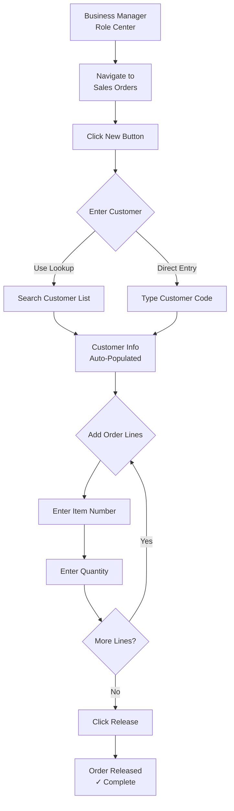
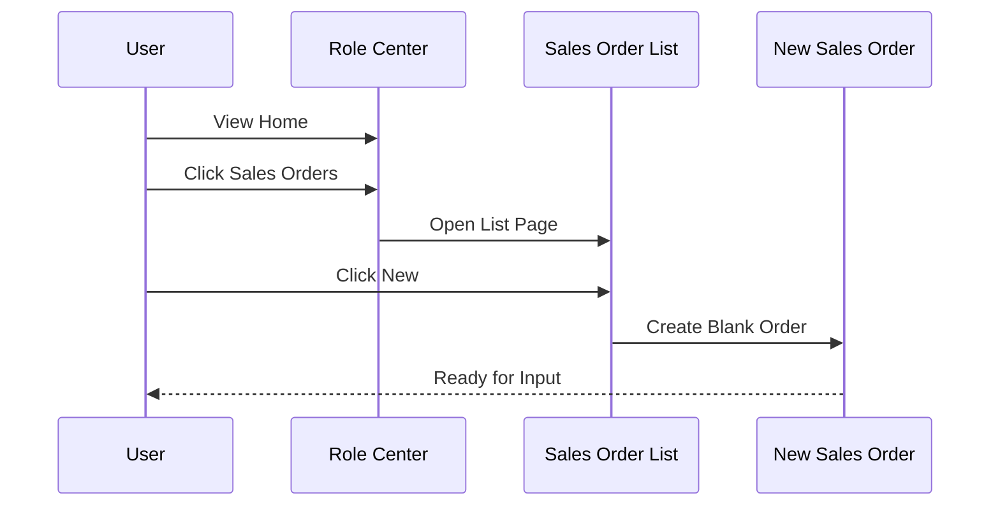
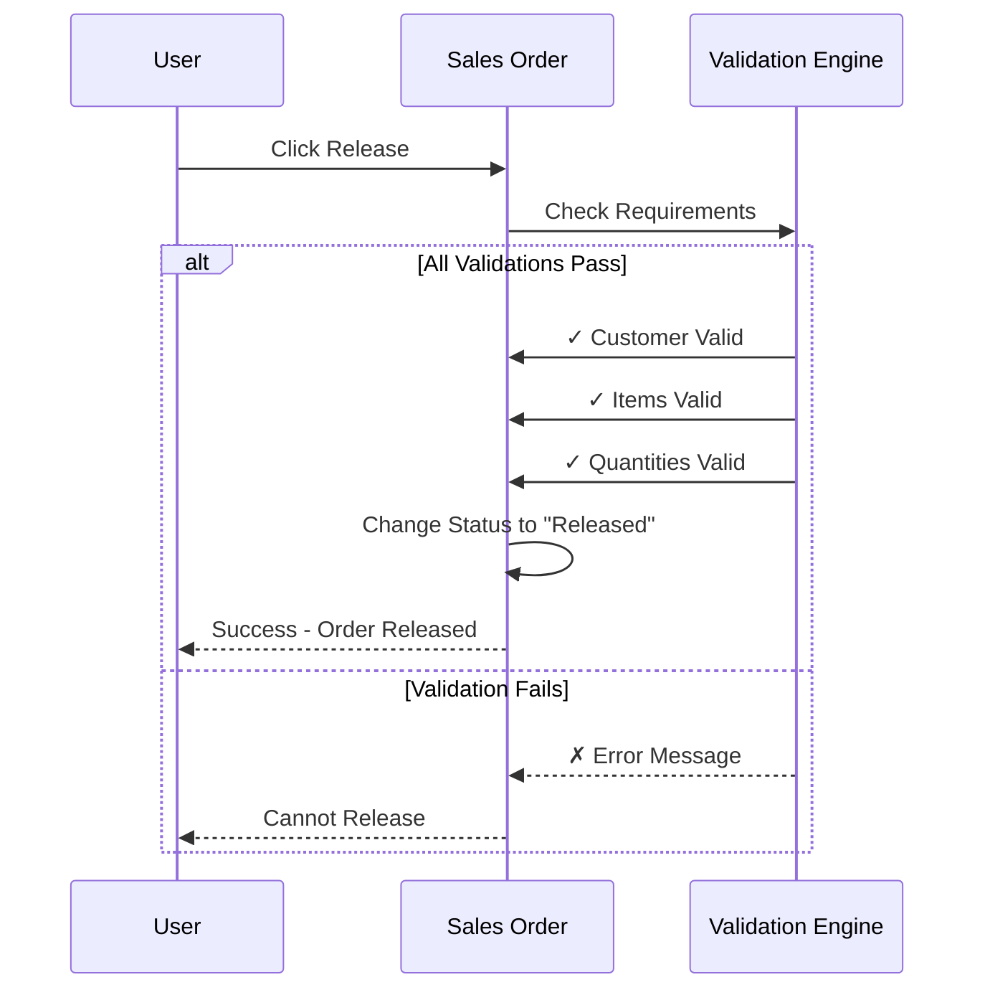

# How to Create and Release a Sales Order

*Generated from Page Scripting Recording*

## Purpose
Create a sales order for a customer, add order line items, and release the order for fulfillment processing.

## Prerequisites
- **User Role**: Business Manager
- **Permissions**: Access to Sales Order List and Sales Order pages
- **Required Setup**:
  - Customer records must exist in the system
  - Item records must be configured with pricing
  - Sales & Receivables setup must be complete

## Estimated Time
**3-5 minutes** for a typical order with 1-2 line items.

## Workflow Overview

## Steps

### 1. Navigate to Sales Orders
From your Business Manager Role Center:
- Locate the **Sales Orders** option in your navigation menu
- Click **Sales Orders**

**Result**: The Sales Order List page opens, showing all existing sales orders.

### 2. Create a New Sales Order
On the Sales Order List page:
- Click the **New** button in the action bar (or press Alt+N)

**Result**: A new blank Sales Order page opens with the status "Open".

**System Interaction:**

### 3. Enter Customer Information

#### Select Customer
The cursor automatically focuses on the **Customer Name** field.

**Method 1: Using Lookup (Recommended)**
- Click the lookup icon (🔍) next to the Customer Name field, or
- Press F6 on your keyboard
- The customer lookup window opens
- Type a search term or scroll to find your customer
- Click to select the customer (Example: Customer 10000)

**Method 2: Direct Entry**
- If you know the customer code, type it directly (e.g., "10000")
- Press Enter or Tab

**Result**: The system automatically fills in related customer information:
- Customer Name
- Bill-to Customer
- Payment Terms
- Shipping Address
- Contact Information

💡 **Tip**: The lookup window makes it easier to find customers by name or search for partial matches.

### 4. Add Order Lines

#### Enter Item Number
In the order lines section (lower part of the page):
- Click in the **No.** field of the first blank line
- The field becomes active for input

**To Select an Item:**
- Start typing (the system shows filter-as-you-type suggestions)
- Or click the lookup icon to open the item catalog
- Select your item (Example: Item 1908-s)

**Result**: 
- Item description automatically populates
- Base unit price appears
- Item details are visible

⚠️ **Note**: This workflow recording shows the user typing "19" then "1908-s", demonstrating the filter-as-you-type feature that narrows down items as you type.

#### Enter Quantity
- Move to the **Quantity** field (Tab or click)
- Enter the number of units to order (Example: 1)

**Result**:
- Line Amount calculates automatically (Quantity × Unit Price)
- Inventory availability may show in related fields
- Line total appears

#### Add Additional Lines (If Needed)
To add more items:
- Click in a new blank line below
- Repeat the item and quantity entry process
- Or press Enter after completing a line to create a new one

### 5. Release the Sales Order

When all order lines are complete and you're ready to proceed:
- Click the **Release** button in the action bar

**What Happens:**
The system performs validation:

**Result**: 
- ✅ Order status changes from "Open" to "Released"
- ✅ Order is now locked from editing
- ✅ Order appears in warehouse processing queues
- ✅ Order is ready for picking, shipping, and invoicing

## Expected Results

After successfully completing this workflow, you should have:

| Item | Status |
|------|--------|
| Sales Order | Created with status "Released" |
| Customer Information | Fully populated |
| Order Lines | At least one line with Item and Quantity |
| System Validation | All checks passed |
| Next Step | Order ready for warehouse processing |

## Tips & Best Practices

### Customer Selection
- **Lookup is faster** for finding customers by name
- **Direct entry is faster** if you already know customer codes
- The system validates customer codes immediately

### Item Selection
- **Filter-as-you-type** helps narrow down items quickly
- Partial item codes work (e.g., typing "19" shows all items starting with 19)
- The lookup window shows item descriptions and availability

### Order Line Entry
- You can add multiple lines before releasing
- Press Enter in the last line to create a new blank line
- Tab key moves between fields efficiently

### Before Releasing
✓ Double-check customer information  
✓ Verify all item numbers are correct  
✓ Confirm quantities and prices  
✓ Review order totals in the FactBox

### Keyboard Shortcuts
| Action | Shortcut |
|--------|----------|
| New Order | Alt+N |
| Open Lookup | F6 |
| Next Field | Tab |
| Previous Field | Shift+Tab |
| Release Order | (varies by configuration) |

## Troubleshooting

### Issue: "Customer cannot be found"
**Cause**: Customer code entered doesn't exist or contains typos.

**Solution**:
1. Use the lookup feature (F6) to search by name
2. Verify customer code spelling
3. Check that customer record exists in the system
4. Contact your administrator if customer needs to be created

### Issue: "Item cannot be found"
**Cause**: Item code entered doesn't exist or item is blocked.

**Solution**:
1. Use the lookup feature to browse available items
2. Verify item code spelling
3. Check that item is not blocked for sales
4. Contact inventory management if item should be available

### Issue: Cannot release order
**Possible Causes & Solutions**:

| Error Message | Likely Cause | Solution |
|---------------|--------------|----------|
| "Customer is blocked" | Customer blocked in system | Contact accounts receivable |
| "Item is blocked" | Item blocked for sales | Contact inventory management |
| "Quantity must be specified" | Missing quantity on line | Enter valid quantity |
| "Nothing to release" | No order lines entered | Add at least one line item |

## Field Reference

### Key Fields in Sales Order Header
| Field | Purpose | Example |
|-------|---------|---------|
| Customer Name | Specify who is ordering | 10000 |
| Order Date | When order was placed | Today's date (auto) |
| Document Date | For document tracking | Today's date (auto) |
| Posting Date | When to post financially | Today's date (auto) |

### Key Fields in Sales Order Lines
| Field | Purpose | Example |
|-------|---------|---------|
| No. | Item being ordered | 1908-s |
| Description | Item description | (auto-populated) |
| Quantity | How many units | 1 |
| Unit Price | Price per unit | (auto-populated) |
| Line Amount | Total for this line | (auto-calculated) |

## Related Procedures
- **How to Edit a Released Sales Order**: Reopening and modifying orders
- **How to Create a Sales Quote**: For preliminary pricing discussions
- **How to Process Sales Shipments**: Next step after order is released
- **How to Handle Customer Returns**: Processing returned items

## Version Information
**Documentation Version**: 1.0  
**Generated From**: Recording.yml  
**Generation Date**: 2026-03-02  
**BC Version**: 24.0 (or applicable version)  
**User Role**: Business Manager

---

*📹 This guide was automatically generated from a Page Scripting recording that captured an actual user workflow. Your system may have customizations or extensions that affect the exact steps or field availability.*

## Quick Start Checklist

Use this checklist for your first few times:

- [ ] Navigated to Sales Orders from Role Center
- [ ] Clicked New to create blank order
- [ ] Selected customer using lookup or direct entry
- [ ] Verified customer information auto-populated
- [ ] Added at least one order line with item number
- [ ] Entered quantity for each line
- [ ] Reviewed totals before releasing
- [ ] Clicked Release button
- [ ] Verified order status changed to "Released"
- [ ] Order is now ready for warehouse processing

## Training Notes

**For Trainers**: Use this workflow as a foundational exercise for new Business Manager users. Consider having trainees:
1. Practice with test customers and items first
2. Try both lookup and direct entry methods
3. Practice adding multiple line items
4. Understand the validation that occurs at release

**For Self-Learners**: This is a core Business Central workflow. Practice until you can complete it in under 3 minutes without referring to the guide.

**Common Learning Points**:
- Understanding the difference between Open and Released status
- Knowing when to use lookup vs direct entry
- Recognizing validation errors before clicking Release
- Understanding how order lines relate to inventory and fulfillment
