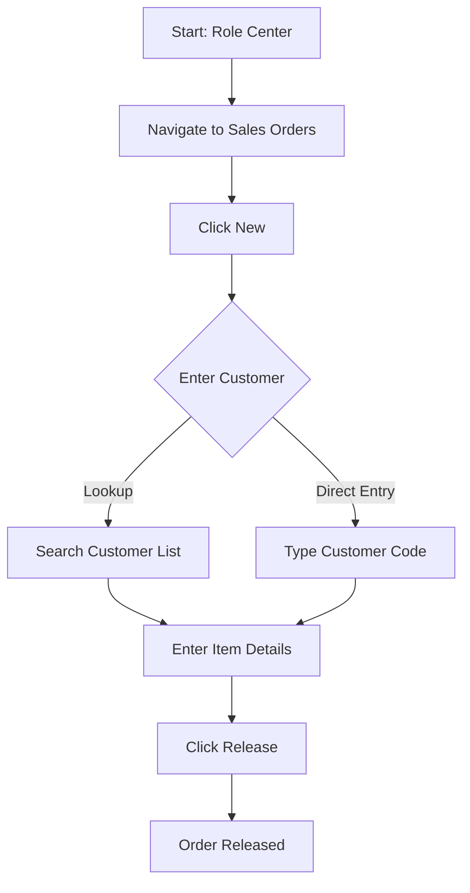
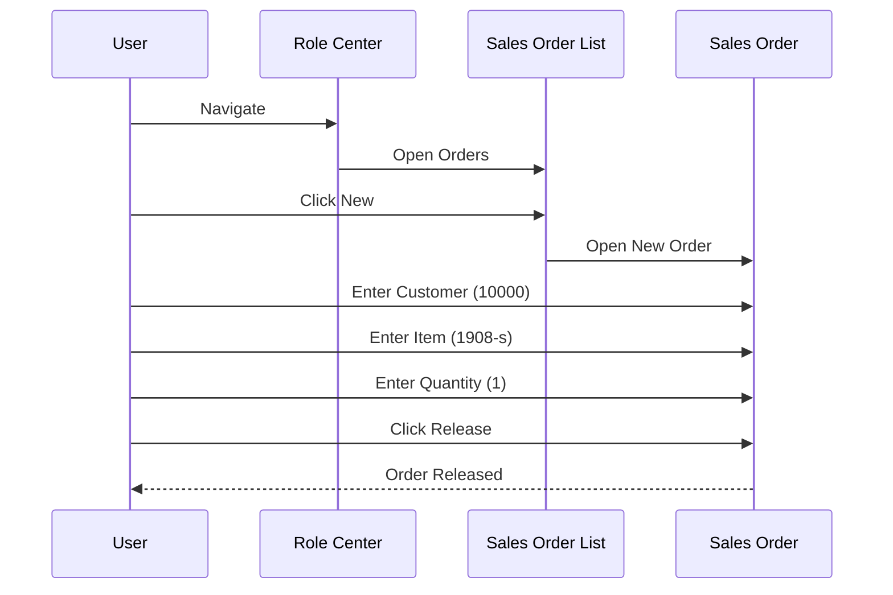

# User Guide Generation from Page Scripting YAML

## Overview

Business Central's Page Scripting feature records user interactions as YAML files for automated testing. These recordings are **perfect** for generating user guides - they capture exactly what users do, with field captions and page names already included in human-readable format.

**Core Principle**: Test recordings and user guides document the same thing - how to use the system. Generate one from the other automatically.

## Why Page Scripting YAML is Perfect for Documentation

### Advantages Over Other Sources

**Compared to Snapshots:**
- ✅ Already structured and human-readable
- ✅ Field captions included (not IDs)
- ✅ Page names included (not object numbers)
- ✅ No need to decode .mdc files or trace execution
- ✅ Focuses on UI interactions, not code execution

**Compared to Manual Documentation:**
- ✅ Captures actual usage, not imagined workflows
- ✅ Quick to capture (just record the workflow)
- ✅ Easy to update (re-record and regenerate)
- ✅ Guaranteed accuracy (recorded from real system)

### What Page Scripting Captures

Page Scripting YAML includes:
- **Page Navigation**: Which pages were opened and in what order
- **Field Interactions**: Which fields were edited and what values entered
- **Actions Invoked**: Which buttons/actions were clicked
- **Lookup Usage**: When users opened dropdown/lookup pages
- **Focus Events**: Where user attention moved
- **Timing**: Implicit workflow sequence

## YAML Structure Understanding

### Recording Metadata

```yaml
name: Recording
description: Test recording
telemetryId: 4214804a-c242-4ccb-8b3f-5e5dda810925
start:
  profile: BUSINESS MANAGER
```

**Documentation Translation:**
- `name`: Becomes document title
- `description`: Can be expanded to document purpose
- `profile`: User role (for role-specific documentation)

### Step Types

#### Navigate Steps
```yaml
- type: navigate
  target:
    - page: Business Manager Role Center
    - action: Sales Orders
  description: Navigate to <caption>Sales Orders</caption>
```

**User Guide Translation:**
> "From the navigation menu, select **Sales Orders**."

#### Page Shown Steps
```yaml
- type: page-shown
  source:
    page: Sales Order List
  modal: false
  runtimeId: b8o
  description: Page <caption>Sales Orders</caption> was shown.
```

**User Guide Translation:**
> "The Sales Orders list page opens."

#### Invoke Steps (Actions/Buttons)
```yaml
- type: invoke
  target:
    - page: Sales Order List
      runtimeRef: b8o
    - action: Control_New
  invokeType: New
  description: Invoke New on <caption>New</caption>
```

**User Guide Translation:**
> "Click the **New** button to create a new sales order."

#### Input Steps (Field Entry)
```yaml
- type: input
  target:
    - page: Sales Order
      runtimeRef: big
    - field: Sell-to Customer Name
  value: "10000"
  description: Input <value>10000</value> into <caption>Customer Name</caption>
```

**User Guide Translation:**
> "In the **Customer Name** field, enter or select the customer (e.g., '10000')."

#### Focus Steps (User Navigation)
```yaml
- type: focus
  target:
    - page: Sales Order
      runtimeRef: big
    - field: Sell-to Customer Name
  description: Focus <caption>Customer Name</caption>
```

**User Guide Translation:**
> (Usually combined with next input step - shows where user clicked/tabbed)

#### Lookup Interactions
```yaml
- type: page-shown
  source:
    page: lookup:Sell-to Customer Name
  modal: false
  runtimeId: b13i
  description: Page <caption>Select</caption> was shown.
```

**User Guide Translation:**
> "A lookup window opens showing available customers. Search or select from the list."

## Documentation Generation Workflow

### Phase 1: Parse YAML Recording

**Extract Key Information:**
```yaml
workflow_analysis:
  name: "Create and Release Sales Order"
  user_role: "Business Manager"
  
  pages_used:
    - "Business Manager Role Center"
    - "Sales Order List"
    - "Sales Order"
    - "Sales Order Subform"
    
  fields_edited:
    - page: "Sales Order"
      field: "Sell-to Customer Name"
      value: "10000"
    - page: "Sales Order Subform"
      field: "No."
      value: "1908-s"
    - page: "Sales Order Subform"
      field: "Quantity"
      value: "1"
      
  actions_invoked:
    - action: "New"
      page: "Sales Order List"
    - action: "Release"
      page: "Sales Order"
      
  lookup_usage:
    - field: "Sell-to Customer Name"
      used_lookup: true
    - field: "No."
      used_lookup: true
```

### Phase 2: Identify Documentation Structure

**Workflow Boundaries:**
1. **Start**: First navigate or page-shown step
2. **Major Steps**: Each invoke action or significant input
3. **Substeps**: Field entries between major steps
4. **End**: Final invoke action or page close

**Example Structure:**
```
1. Navigate to Sales Orders
2. Create New Order
   a. Enter Customer Name (lookup)
   b. System fills related fields
3. Add Order Line
   a. Enter Item Number (lookup)
   b. Enter Quantity
4. Release Order
```

### Phase 3: Generate User Guide Content

**Template Application:**

```markdown
# [Recording Name]: How to [Workflow Purpose]

## Purpose
[Derived from recording description and actions]

## Prerequisites
[Infer from Role Profile]
- User Role: [Profile from YAML]
- Required Permissions: [Page access implied by navigation]

## Estimated Time
[Count of substantive steps, estimate ~30 sec per step]

## Steps

### 1. [First Major Action]
[Generated from steps]

[Repeat for each major step]

## Expected Results
[Final state based on last actions]

## Tips & Notes
[Derived from lookup usage and patterns]

## Quick Reference
[Key fields and values used]
```

### Phase 4: Add Visual Documentation

**Generate Flowchart:**


**Generate Sequence Diagram:**


## Practical Example: Sales Order Creation

### Input YAML (Abbreviated)

```yaml
name: Recording
description: Test recording
start:
  profile: BUSINESS MANAGER
steps:
  - type: navigate
    target: [Sales Orders]
  - type: invoke
    invokeType: New
  - type: input
    target: [Sell-to Customer Name]
    value: "10000"
  - type: input
    target: [No.]
    value: "1908-s"
  - type: input
    target: [Quantity]
    value: "1"
  - type: invoke
    target: [Release]
```

### Generated User Guide

```markdown
# How to Create and Release a Sales Order

## Purpose
Create a sales order for a customer and release it for fulfillment processing.

## Prerequisites
- **User Role**: Business Manager
- **Permissions**: Access to Sales Order List and Sales Order pages
- Customer and Item records must exist in the system

## Estimated Time
**3-5 minutes** for a typical order with one line item.

## Steps

### 1. Navigate to Sales Orders
From the Business Manager Role Center:
- Click **Sales Orders** in the navigation menu

The Sales Order List page opens showing existing orders.

### 2. Create a New Order
- Click the **New** button in the action bar

A blank sales order page opens with status **Open**.

### 3. Enter Customer Information
In the **Customer Name** field:
- Enter the customer code (e.g., "10000") or
- Click the lookup icon to search and select

💡 **Tip**: This recording shows the customer was selected using the lookup feature.

### 4. Add Order Line

#### Enter Item Number
In the first line of the order details:
- In the **No.** field, enter or lookup the item code (e.g., "1908-s")
- A lookup window appears - you can search or browse items
- Select the item from the list

#### Enter Quantity
- In the **Quantity** field, enter the number of units (e.g., "1")
- The system automatically calculates line amounts

### 5. Release the Order
When all order details are complete:
- Click the **Release** button in the action bar

The order status changes to **Released** and is ready for warehouse processing.

## Expected Results
After successfully completing these steps:
- ✅ New sales order is created
- ✅ Customer and item information are populated
- ✅ Order is released and locked from editing
- ✅ Order appears in warehouse processing queues

## Tips & Notes
- **Customer Selection**: This workflow uses the lookup feature. You can also type the customer code directly if you know it.
- **Item Selection**: The lookup helps ensure you select the correct item by showing descriptions and availability.
- **Required Fields**: Customer Name, Item No., and Quantity are the minimum fields needed before release.

## Quick Reference

| Field | Example Value | Description |
|-------|---------------|-------------|
| Customer Name | 10000 | Customer code or search term |
| Item No. | 1908-s | Item code or search term |
| Quantity | 1 | Number of units to order |

## Related Procedures
- How to Check Order Status
- How to Create a Credit Memo
- How to Process Shipments

---

*📹 This guide was generated from a Page Scripting recording captured on [date]. System behavior may vary based on your configuration and extensions.*
```

## Advanced Features

### Handling Repeater Patterns

**YAML Shows Repeated Actions:**
```yaml
- type: input
  target: [SalesLines, No.]
  value: "1908-s"
- type: input
  target: [SalesLines, Quantity]
  value: "1"
- type: input
  target: [SalesLines, No.]
  value: "1900-s"
- type: input
  target: [SalesLines, Quantity]
  value: "5"
```

**Documentation Translation:**
```markdown
### 4. Add Order Lines
For each item to order, repeat these steps:

**Line 1:**
- Item No.: 1908-s
- Quantity: 1

**Line 2:**
- Item No.: 1900-s
- Quantity: 5

💡 **Tip**: Click **+ New Line** or press Enter in the last row to add more lines.
```

### Detecting Validation Patterns

**YAML May Show:**
```yaml
- type: input
  value: "invalid-customer"
- type: page-shown
  source:
    page: Error Dialog
- type: close-page
```

**Documentation Translation:**
```markdown
### Troubleshooting: Customer Not Found
If you enter an invalid customer code, an error dialog appears:
- **Error**: "The customer cannot be found"
- **Solution**: Use the lookup feature or verify the customer code
```

### Identifying Optional vs Required Fields

**Pattern Analysis:**
```yaml
# Always filled in recordings:
- field: Customer Name (REQUIRED)
- field: Item No. (REQUIRED)
- field: Quantity (REQUIRED)

# Sometimes skipped:
- field: Ship-to Name (OPTIONAL)
- field: External Document No. (OPTIONAL)
```

**Documentation Note:**
```markdown
## Required vs Optional Fields
**Required before release:**
- Customer Name
- At least one line with Item No. and Quantity

**Optional (system will use defaults):**
- Ship-to Name
- External Document No.
```

### Role-Based Documentation

**Recording Metadata:**
```yaml
start:
  profile: BUSINESS MANAGER
```

**Documentation Targeting:**
```markdown
# How to Create a Sales Order
*For Business Managers*

> ℹ️ **Note**: This procedure requires Business Manager role permissions. Users with limited roles may see different menu options or restricted field access.
```

## Comparison with Other Sources

### Page Scripting YAML vs Snapshot Files

| Aspect | Page Scripting YAML | Snapshot Files |
|--------|-------------------|----------------|
| **Capture Level** | UI interactions | Code execution |
| **Readability** | Human-readable | Binary data |
| **Setup** | Record mode in BC | Debugger attachment |
| **Documentation Focus** | User guides | Debugging guides |
| **Extension Visibility** | Limited | Complete |
| **Best For** | "How to use" | "Why it failed" |

### When to Use Each

**Use Page Scripting YAML when:**
- Creating end-user documentation
- Documenting standard workflows
- Training new users
- Validating test scenarios match documentation

**Use Snapshots when:**
- Debugging errors and performance issues
- Documenting complex extension interactions
- Understanding system internals
- Analyzing production issues

**Use Both when:**
- Recording workflow that occasionally errors (YAML for happy path, Snapshot for error analysis)
- Comprehensive documentation (YAML for user guide, Snapshot for troubleshooting section)

## Automation Opportunities

### Batch Documentation Generation

```yaml
documentation_project:
  source_recordings:
    - "Recording_CreateSalesOrder.yml"
    - "Recording_ProcessPurchase.yml"
    - "Recording_PostInventory.yml"
    
  output_settings:
    format: "markdown"
    include_diagrams: true
    language: "en-US"
    
  documentation_type: "user_guide"
  
  batch_generate:
    output_directory: "docs/user-guides/"
    naming_pattern: "{recording_name}_UserGuide.md"
    include_toc: true
```

### Template Customization

```yaml
documentation_template:
  sections:
    - name: "Purpose"
      include: true
    - name: "Prerequisites"
      include: true
      auto_detect_role: true
    - name: "Steps"
      include: true
      numbering: "automatic"
      include_substeps: true
    - name: "Visual Diagrams"
      include: true
      diagram_types: ["flowchart", "sequence"]
    - name: "Troubleshooting"
      include: true
      detect_error_patterns: true
    - name: "Quick Reference"
      include: true
      generate_field_table: true
```

### Documentation Maintenance

**Version Tracking:**
```markdown
---
title: "How to Create a Sales Order"
version: "1.3"
last_updated: "2026-03-02"
source_recording: "Recording_CreateSalesOrder_v3.yml"
bc_version: "24.0"
verified_by: "Jane Consultant"
next_review: "2026-06-02"
---
```

**Change Detection:**
- Re-record workflow periodically
- Compare YAML step sequences
- Highlight documentation sections that changed
- Update affected user guides

## Quality Standards

### Documentation Completeness
- ✅ All major steps documented
- ✅ Field purposes explained
- ✅ Actions clearly labeled
- ✅ Expected results described
- ✅ Prerequisites listed
- ✅ Estimated time provided

### Accuracy Validation
- ✅ Field names match recording exactly
- ✅ Page names match recording exactly
- ✅ Action sequences are chronological
- ✅ Values shown are realistic examples
- ✅ Lookup usage accurately described

### User-Friendliness
- ✅ Business language (no technical jargon)
- ✅ Visual diagrams included
- ✅ Tips and notes highlight key points
- ✅ Troubleshooting section included
- ✅ Quick reference table provided

## Metadata for Documentation Management

```yaml
document_metadata:
  title: "How to Create and Release a Sales Order"
  type: "user_guide"
  
  source_data:
    recording_file: "Recording_CreateSalesOrder.yml"
    recording_date: "2026-03-02"
    recorded_by: "Jane Consultant"
    
  target_audience:
    primary_role: "Business Manager"
    skill_level: "Beginner"
    
  documentation_info:
    generated_by: "Taylor Docs"
    generated_date: "2026-03-02"
    format: "Markdown"
    includes_diagrams: true
    
  quality_assurance:
    technical_review: true
    user_validation: false  # Pending
    accessibility_check: true
    
  distribution:
    internal_wiki: true
    training_portal: true
    help_system: false
    
  maintenance:
    review_frequency: "Quarterly"
    next_review_date: "2026-06-02"
```

## Best Practices

### Recording Quality
- **Record complete workflows**: Start to finish, no partial sequences
- **Use realistic data**: Meaningful customer codes, item numbers
- **Normal pace**: Don't rush - record at actual user speed
- **Include common variations**: Record both lookup and direct entry methods

### Documentation Style
- **Action-oriented**: "Click the button" not "The button can be clicked"
- **Present tense**: "The page opens" not "The page will open"
- **Specific examples**: "Enter '10000'" not "Enter a customer code"
- **Consistent formatting**: Bold for UI elements, code formatting for values

### Visual Enhancement
- **Flowcharts for overview**: Show decision points and paths
- **Sequence diagrams for interaction**: Show system responses
- **Screenshots when helpful**: Supplement generated text (not from YAML, but recommended)
- **Tables for reference**: Field lists, quick references

## Summary

- Page Scripting YAML files are ideal sources for user guide generation
- YAML is already structured and human-readable with captions included
- Workflow: Parse YAML → Identify structure → Generate content → Add diagrams
- Advantages: Quick capture, easy updates, guaranteed accuracy
- Best for end-user documentation and training materials
- Complement with snapshot analysis for troubleshooting sections
- Automate batch documentation generation for efficiency

*Code examples: see samples/user-guide-from-page-scripting.md*
*Related patterns: user-guide-from-snapshot.md, mermaid-diagram-documentation.md*
