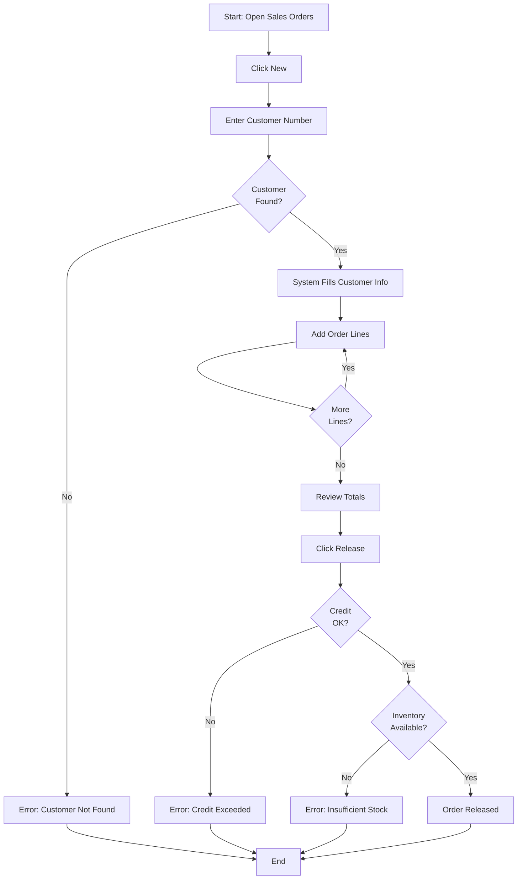
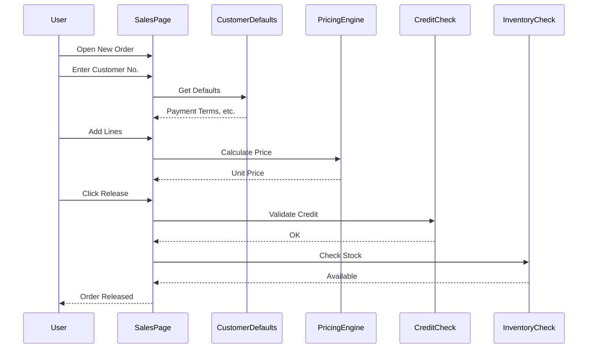
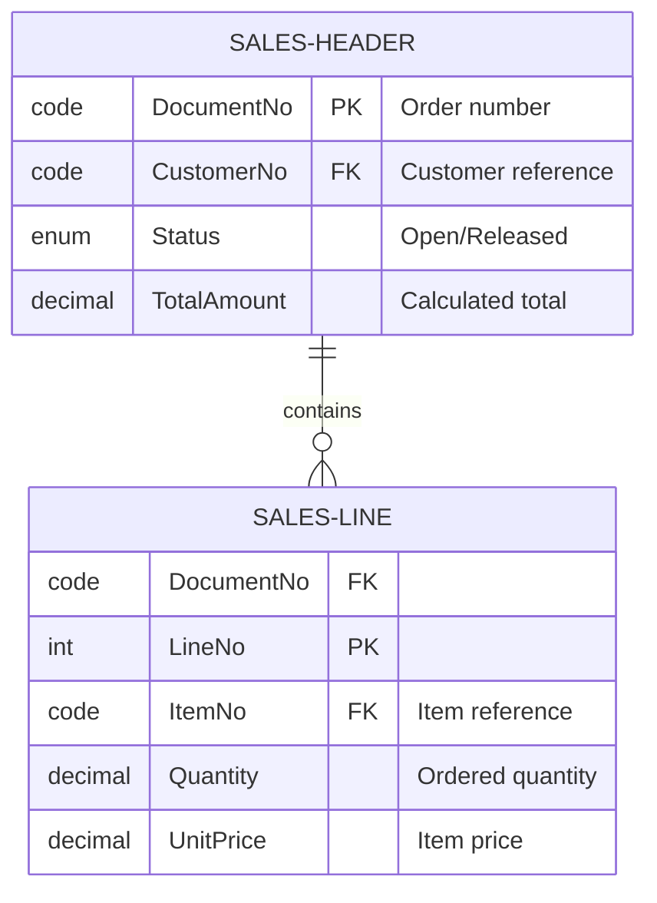

# User Guide Generation from Snapshot Analysis

## Overview

Traditional user guide creation is time-consuming and quickly becomes outdated. By analyzing snapshots of real users performing tasks, you can automatically generate comprehensive, accurate user guides that reflect actual product behavior including all customizations (PTEs) and AppSource extensions.

**Core Principle**: Capture reality, then document it. Real user workflows are more valuable than imagined ideal workflows.

## The Documentation Challenge

### Traditional User Guide Problems
- **Time-intensive**: Screenshots, descriptions, validation take hours per guide
- **Quickly outdated**: Every release invalidates screenshots and steps
- **Incomplete coverage**: Extensions and customizations poorly documented
- **Idealized workflows**: Don't reflect how users actually use the system
- **Maintenance burden**: Updates require manual rework

### Snapshot-Driven Advantages
- **Automatic capture**: Record real user sessions in minutes
- **Complete coverage**: Includes all extensions automatically
- **Real workflows**: Documents actual usage patterns
- **Easy updates**: Re-record workflow, regenerate documentation
- **Validation included**: Error handling documented from actual validations

## Documentation Generation Workflow

### Phase 1: Receive Interaction Analysis (from Dean)

**Input from Dean's snapshot UI analysis:**
```yaml
workflow_name: "Create and Release Sales Order"
pages_accessed:
  - id: 42
    name: "Sales Order"
    file_count: 245
  - id: 21
    name: "Customer Card"
    file_count: 18

user_actions:
  - step: 1
    action: "OnOpenPage"
    page: "Sales Order"
    description: "User opened new sales order"
    
  - step: 2
    action: "OnValidate"
    page: "Sales Order"
    field: "Sell-to Customer No."
    value: "CUST001"
    auto_populated:
      - "Sell-to Customer Name"
      - "Payment Terms Code"
    
  - step: 3
    action: "OnAction"
    page: "Sales Order"
    button: "Release"
    validations_run:
      - extension: "PTE-CreditCheck"
        result: "Pass"
      - extension: "AppSource-InventoryValidation"
        result: "Pass"

extensions_involved:
  - name: "PTE-CustomerDefaults"
    impact: "Auto-populates customer information"
  - name: "AppSource-PricingEngine"
    impact: "Calculates unit prices"
  - name: "PTE-TaxCalculation"
    impact: "Computes tax amounts"
```

### Phase 2: Receive UX Interpretation (from Uma)

**Input from Uma's user experience analysis:**
```yaml
workflow_assessment:
  complexity: "Medium"
  decision_points: 3
  common_errors:
    - "Customer not found"
    - "Credit limit exceeded"
    - "Insufficient inventory"
  
workflow_efficiency:
  steps_required: 7
  navigation_changes: 1
  lookup_operations: 2
  
user_intent:
  primary_goal: "Create sales order for customer"
  secondary_goals:
    - "Validate customer credit"
    - "Verify inventory availability"
    - "Calculate accurate totals"
    
ui_hotspots:
  - location: "Customer No. field"
    importance: "Critical - entire order depends on this"
  - location: "Release button"
    importance: "High - triggers multiple validations"
    
suggested_improvements:
  - "Add inline help for credit validation"
  - "Show inventory availability earlier"
```

### Phase 3: Generate Documentation Structure

#### Document Outline Template

```markdown
# [Workflow Name]

## Purpose
[What business goal does this accomplish?]

## Prerequisites
[What must exist/be configured before starting?]

## Estimated Time
[How long does this typically take?]

## Steps
[Numbered, actionable steps]

## Expected Results
[What should the user see when successful?]

## Troubleshooting
[Common errors and solutions]

## Extension Features
[Which extensions enhance this workflow?]

## See Also
[Related procedures]
```

#### Content Generation Rules

**For each user action:**
1. **Translate to business language**
   - `OnValidate("Customer No.")` → "Enter the customer number"
   - `OnAction("Release")` → "Click the Release button"
   - `OnLookup` → "Search for and select"

2. **Add context and explanation**
   - Why is this step necessary?
   - What happens automatically?
   - What should the user expect to see?

3. **Include validation information**
   - What checks occur?
   - What errors might appear?
   - How to resolve common issues?

4. **Note extension impact**
   - Which extensions affect this step?
   - What features do they provide?
   - Are they optional or required?

### Phase 4: Create Visual Documentation

#### Generate Workflow Diagrams

**User Decision Flowchart:**


**System Interaction Sequence:**


#### Add Field/Table Diagrams (if helpful)



### Phase 5: Write Comprehensive User Guide

#### Example Generated Content

```markdown
# How to Create and Release a Sales Order

## Purpose
Create a sales order to record customer product requests and trigger fulfillment processes.

## Prerequisites
Before creating a sales order, ensure:
- Customer record exists in the system
- Items are configured with current pricing
- Customer credit limit is established (if credit checking is enabled)

## Estimated Time
**2-5 minutes** for a typical order with 1-5 line items.

## Steps

### 1. Open the Sales Order Page
From the main navigation:
- Click **Sales & Receivables** in the navigation menu
- Select **Orders**, or
- Use the search function (Alt+Q) and type "Sales Orders"

### 2. Create a New Order
Click the **+ New** button in the action bar to create a blank sales order.

The system creates a new document with status **Open**.

### 3. Enter Customer Information

#### Enter Customer Number
In the **Sell-to Customer No.** field:
- Click the lookup icon (or press F6) to search for customers
- Or type the customer number directly if you know it
- Example: Enter "CUST001"

#### Automatic Population
Once you select a customer, the system automatically fills in:
- **Sell-to Customer Name**: Customer's full name
- **Bill-to Customer**: Defaults to sell-to customer
- **Payment Terms Code**: From customer defaults
- **Shipment Method Code**: Based on customer preferences

*💡 **Extension Feature**: The CustomerDefaults extension provides additional automatic field population based on your company's custom rules.*

### 4. Add Order Lines

For each item the customer is ordering:

#### Select Item
- Click in a blank **Item No.** field in the lines grid
- Use the lookup (F6) or type the item number
- Example: "ITEM-1000"

#### Enter Quantity
- In the **Quantity** field, enter how many units are needed
- Example: 10

#### Verify Price
- The **Unit Price** field automatically populates based on:
  - Standard item price list
  - Customer-specific pricing agreements
  - Volume discounts (if applicable)
  
*💡 **Extension Feature**: The PricingEngine calculates special promotional prices and quantity discounts.*

#### Review Line Total
Check the **Line Amount** field to verify the line total (Quantity × Unit Price).

#### Add More Lines
Repeat for each item. Click **+ New Line** or press Enter in the last row.

### 5. Review Order Totals

On the right side of the page, the **Order Details** FactBox shows:
- **Subtotal**: Sum of all line amounts
- **Tax Amount**: Calculated based on customer tax area
- **Total Amount**: Final order total

*💡 **Extension Feature**: The TaxCalculation extension applies custom tax rules based on ship-to location.*

### 6. Release the Order

When all lines are correct and you're ready to proceed:

#### Click Release Button
- In the action bar, click the **Release** button
- Or use keyboard shortcut: Ctrl+F9

#### System Validation
The system automatically checks:

1. **Customer Credit Limit** *(Extension: CreditCheck)*
   - Compares order total to available credit
   - If credit is exceeded, shows error message
   
2. **Inventory Availability** *(Extension: InventoryValidation)*
   - Verifies items are in stock or can be procured
   - Warns if stock is insufficient

3. **Required Field Completion**
   - Ensures all mandatory fields have values
   - Validates data formats

#### Successful Release
If all validations pass:
- Order status changes from **Open** to **Released**
- Document is locked from further editing
- Order appears in warehouse pick lists
- Finance team can create invoice

## Expected Results

After successfully releasing the order, you should see:
- ✅ Status field shows **Released**
- ✅ Green confirmation banner: "Order has been released"
- ✅ Edit fields are now disabled (locked)
- ✅ Order number is preserved and visible

## Troubleshooting

### Error: "The customer cannot be found"
**Cause**: Customer number entered doesn't exist in the system.

**Solution**:
1. Verify customer number spelling
2. Search using customer name instead
3. Create new customer record if needed (requires permissions)

### Error: "Credit limit exceeded"
**Cause**: Order total would exceed customer's available credit. *(Extension: CreditCheck)*

**Solution**:
1. Review customer's current balance and credit limit
2. Contact finance team to request credit increase
3. Reduce order quantity/amount
4. Request payment in advance

### Error: "Insufficient inventory for item XXXX"
**Cause**: Requested quantity exceeds available stock. *(Extension: InventoryValidation)*

**Solution**:
1. Check item availability report
2. Reduce order quantity to available amount
3. Contact purchasing to order more stock
4. Choose different item variant if available

### Warning: "Some line prices are zero"
**Cause**: Price list may be missing or customer pricing not configured.

**Solution**:
1. Verify item pricing is set up
2. Check customer price agreements
3. Manually enter correct price (if authorized)

## Extension Features in This Workflow

This workflow includes functionality from the following extensions:

| Extension | Purpose | Impact on Workflow |
|-----------|---------|-------------------|
| **PTE-CustomerDefaults** | Auto-populate customer info | Saves time by filling payment terms, shipment methods |
| **AppSource-PricingEngine** | Calculate special prices | Applies promotions, volume discounts automatically |
| **PTE-TaxCalculation** | Compute accurate tax | Uses custom tax rules for your business |
| **PTE-CreditCheck** | Validate credit limits | Prevents over-extension of customer credit |
| **AppSource-InventoryValidation** | Check stock availability | Warns about insufficient inventory before release |

## See Also

- **How to Ship a Sales Order**: Next step after releasing
- **How to Create a Sales Quote**: For preliminary pricing discussions
- **How to Handle Customer Returns**: Processing returned items
- **Credit Management Setup**: Configuring credit limits and checks

## Quick Reference

| Action | Keyboard Shortcut |
|--------|------------------|
| Open Search | Alt+Q |
| Lookup Field | F6 |
| Release Order | Ctrl+F9 |
| Save Changes | Ctrl+S |
| Close Page | Esc |

---

*📸 This documentation was generated from actual workflow capture on 2026-03-02. If your system behavior differs, your extensions may have been updated. Contact your system administrator for guidance.*
```

## Documentation Quality Standards

### Clarity Checklist
- ✅ Steps are numbered and actionable
- ✅ Business language (no technical jargon) used
- ✅ Field names match actual UI labels
- ✅ Extension impact is clarified
- ✅ Expected results are described
- ✅ Common errors are documented

### Completeness Checklist
- ✅ Prerequisites listed
- ✅ Visual diagrams included
- ✅ Troubleshooting section provided
- ✅ Extension features documented
- ✅ Related procedures linked
- ✅ Keyboard shortcuts noted

### Accuracy Checklist
- ✅ Steps tested against actual system
- ✅ Field names verified from .al files
- ✅ Validation messages match snapshot
- ✅ Extension names are correct
- ✅ Workflow reflects real user experience

## Integration with Other Documentation Types

### Debugging Docs (Dean Focus)
**Audience**: Developers and support
**Content**: Technical call chains, variable values, root cause
**Use Case**: "Why did this fail?"

### User Guides (Taylor Focus)
**Audience**: End users and trainers
**Content**: Step-by-step procedures, business context
**Use Case**: "How do I do this?"

### Architecture Docs (Alex Focus)
**Audience**: Architects and senior developers
**Content**: System design, extension boundaries
**Use Case**: "How is this structured?"

## Maintenance Strategy

### When to Update
- System upgrade or version change
- Extension added or removed
- Workflow changes based on user feedback
- UI changes affect screenshots/descriptions

### How to Update
1. **Re-record snapshot**: Have user perform updated workflow
2. **Re-analyze**: Dean extracts new interaction trace
3. **UX review**: Uma validates workflow still makes sense
4. **Regenerate**: Taylor creates updated documentation
5. **Compare**: Highlight what changed from previous version

### Version Control
```markdown
---
title: "How to Create and Release a Sales Order"
version: "2.1"
last_updated: "2026-03-02"
bc_version: "24.0"
snapshot_source: "SNAPSHOT-2026-03-02-001.snap"
extensions_included:
  - "PTE-CustomerDefaults v1.2"
  - "AppSource-PricingEngine v3.0"
  - "PTE-TaxCalculation v1.5"
  - "PTE-CreditCheck v2.0"
  - "AppSource-InventoryValidation v1.8"
---
```

## Advanced Techniques

### Multi-Path Documentation
Some workflows have decision points. Document each path:

```markdown
## Scenario A: Standard Order
[Steps for typical order]

## Scenario B: Back Order
[Steps when inventory insufficient]

## Scenario C: Credit Hold
[Steps when customer credit exceeded]
```

### Role-Based Variations
Different user roles may see different options:

```markdown
## For Order Processors
[Standard user steps]

## For Sales Managers
[Additional steps: Override credit, Special discounts]

## For Administrators
[Setup and configuration options]
```

### Integration Documentation
When workflow crosses systems:

```markdown
## Integration Points

### With Warehouse Management
After releasing, the order:
- Appears in pick list generation
- Triggers inventory reservation
- [Additional WMS steps]

### With Accounts Receivable
Order creates:
- Customer ledger entries
- Credit limit tracking
- [Additional AR impact]
```

## Best Practices

### Writing Style
- **Active voice**: "Click the Release button" (not "The Release button should be clicked")
- **Present tense**: "The system validates" (not "The system will validate")
- **Direct instructions**: "Enter customer number" (not "You should enter the customer number")
- **Short sentences**: One action per sentence when possible

### Visual Aids
- **Flowcharts**: For decision-heavy workflows
- **Sequence diagrams**: For complex system interactions
- **Tables**: For field descriptions and reference data
- **Callout boxes**: For important notes and warnings

### Accessibility
- **Alt text**: Describe all diagrams in prose too
- **Keyboard shortcuts**: Include them for all actions
- **Clear language**: Avoid idioms and cultural references
- **Structured headings**: Enable screen reader navigation

## Metadata for Documentation Management

```yaml
document_metadata:
  title: "How to Create and Release a Sales Order"
  category: "Sales Order Processing"
  audience: "End Users"
  difficulty: "Beginner"
  estimated_time: "5 minutes"
  
  source_data:
    snapshot_file: "SNAPSHOT-2026-03-02-001.snap"
    capture_date: "2026-03-02"
    captured_by: "jane.consultant@company.com"
    
  coverage:
    bc_version: "24.0"
    base_application: true
    extensions:
      - "PTE-CustomerDefaults v1.2"
      - "AppSource-PricingEngine v3.0"
      
  quality_checks:
    technical_review: "dean-debug"
    ux_review: "uma-ux"
    documentation_review: "taylor-docs"
    user_validation: true
    
  distribution:
    help_system: true
    training_portal: true
    knowledge_base: true
    pdf_export: true
```

## Summary

- User guides can be generated from snapshot analysis of real workflows
- Dean extracts interaction trace, Uma provides UX interpretation, Taylor creates documentation
- Generated docs include all PTEs and AppSource extensions automatically
- Visual diagrams (flowcharts, sequence diagrams) enhance understanding
- Documentation maintenance is easy: re-record and regenerate
- Quality standards ensure clarity, completeness, and accuracy
- Metadata enables documentation management and version control

*Code examples: see samples/user-guide-from-snapshot.md*
*Related patterns: mermaid-diagram-documentation.md, snapshot-ui-interaction-analysis.md*
